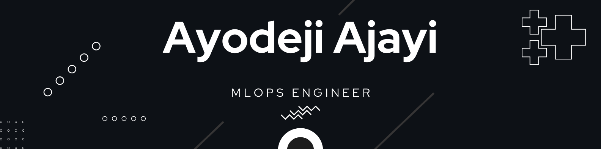

  <h4>
   AI and ML Ops Engineer with expertise in machine learning, NLP, Computer Vision, DevOps principles. Bridging AI research and practical solutions for real-world impact. Committed to creating ethical, intelligent systems that enhance problem-solving, aiming to make the world more efficient and connected.
  </h4>

  

- 👨‍💻 All of my projects are available at [github.com/ayyodeji](github.com/ayyodeji)

- 📫 How to reach me **ajayi.ayyodeji@gmail.com**

<h3 align="left">Connect with me:</h3>

<h3 align="left">Languages and Tools:</h3>

                                   

